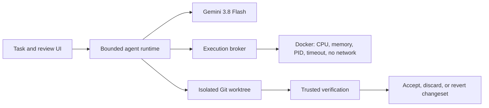

# AI Operator

[](https://github.com/youssef061204/AI-Operator/actions/workflows/verify.yml)

A secure local autonomous software-engineering agent that runs Gemini 3.8 Flash inside isolated Git workspaces, executes approved commands in resource-limited Docker containers, independently verifies work, and presents a reviewable changeset before touching the developer's working tree.

## Why it exists

An LLM can propose useful code changes, but it should not decide its own permissions or declare itself successful. AI Operator keeps model reasoning nondeterministic while making validation, permissions, execution, state transitions, verification, rollback, and evidence deterministic and observable.



## Measured evidence

| Evidence                   |                                           Result | Meaning                                                                                    |
| -------------------------- | -----------------------------------------------: | ------------------------------------------------------------------------------------------ |
| Runtime safety evaluation  | 42/42 expected outcomes, 0 permission violations | 14 deterministic scenarios repeated 3 times with real tools; not an LLM success rate       |
| Coding benchmark integrity |                                      50/50 tasks | Every known-bad fixture fails and every reference solution passes its independent grader   |
| Automated tests            |               31 cases, 0 failures in final pass | 28 passed; Docker daemon and Windows symlink privilege caused 3 explicit environment skips |
| Docker security checks     |                                       2/2 passed | Network disabled and timed-out containers cleaned up                                       |
| Dependency audit           |                                     0 advisories | Full pnpm graph at the recorded verification point                                         |

Live Gemini capability results are reported only after a real run. Reference-solution integrity is never presented as model performance.

## Quickstart

Requirements: Node 24.13+, pnpm 10.6, Docker Desktop, a Google AI Studio key, and Git.

```powershell
pnpm install --frozen-lockfile
docker pull node:24.13.0-bookworm-slim
Copy-Item .env.example .env
# Add GEMINI_API_KEY to .env. Default model: gemini-3.8-flash
pnpm dev
```

The launcher checks ports and prerequisites, starts the runtime and web UI, and opens a one-use browser connection. The permanent runtime token is never placed in frontend assets or a URL. The browser exchanges the fragment capability for an HttpOnly, SameSite session cookie.

Select a Git repository, describe the task, and supply verification. Each task works in a detached isolated worktree. The review screen shows changed files and lets you accept, discard, or revert the frozen changeset.

## Safety model

- Strict model-decision and tool schemas; Gemini cannot set its own risk or permissions.
- Exact, expiring, one-use approval digests. High-risk commands require action-specific approval.
- Hash-guarded writes, traversal/symlink/junction/hardlink defenses, bounded UTF-8 files and output.
- Docker execution defaults to one CPU, 512 MiB memory, 128 PIDs, read-only container root, dropped capabilities, no new privileges, no network, and a task-workspace-only mount.
- Git task isolation preserves the active branch, index, staged changes, and safe untracked files.
- Multi-file changesets preflight all paths and journal progress. Conflicting external edits are preserved and surfaced.
- Cancellation cannot later become completion; verification must pass independently before acceptance.

Docker reduces exposure but is not a perfect security boundary. Multi-file acceptance is crash-recoverable but cannot provide simultaneous filesystem-wide visibility. See [security.md](docs/security.md).

## Evaluation

```powershell
pnpm typecheck
pnpm lint
pnpm format:check
pnpm test
pnpm test:browser
pnpm evaluate
pnpm benchmark:integrity
pnpm benchmark:live -- --model gemini-3.8-flash --limit 50
pnpm build
pnpm audit
```

The benchmark contains 50 distinct tasks across algorithms, parsing, validation, API logic, data handling, async state, TypeScript, UI state, cross-file work, and features. Graders live outside the model workspace; candidate code is graded in Docker with no network and read-only mounts. Every attempt, failure, timeout, token count, latency, tool call, and unknown cost is retained.

## Supported structure

```text
apps/web/                    task, approval, changeset and evaluation UI
packages/agent/src/runtime/  agent loop, providers, tools, execution and workspaces
packages/shared/             API contracts
benchmarks/                  50-task catalog and independent runner
tests/                       browser flow
docs/                        architecture, security and evaluation method
historical/                  excluded pre-rebuild sources for review only
```

The supported model is `gemini-3.8-flash`. `GEMINI_API_KEY` stays in the ignored local environment. The model receives only context selected by the runtime. Historical Python, duplicate frontend, desktop viewer, and monolithic automation sources are excluded from the workspace and must not be run.

Technical details: [architecture](docs/architecture.md) · [transformation audit](docs/transformation-audit.md) · [evaluation](docs/evaluation.md) · [interview guide](docs/interview-guide.md)
