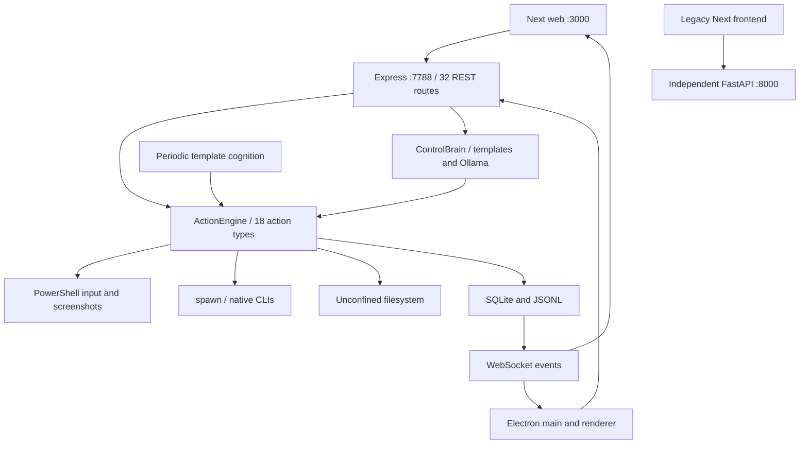

# Architecture at baseline

Request lifecycle: HTTP routes parse Zod requests, enqueue caller-specified envelopes, persist and pump a serial queue. Cognition periodically samples processes/network and builds keyword-selected batches. ControlBrain can request Ollama OS steps and falls back to templates. Tool lifecycle: switch on 18 types, parse inputs again, execute adapter, save result, broadcast. Six action states exist: queued, awaiting approval, running, success, failed, canceled. Four risk labels exist; classification is caller-controlled. Permissions are arbitrary strings with once/session/always grant interfaces; once only logs a grant. Empty permissions bypass approval. Approval IDs identify mutable queue entries; there is no action digest or expiration.

Persistence: synchronous SQLite WAL for actions, logs, settings and devices plus JSONL logging. Cognition goals/memory/tools are JSON settings. Startup changes running actions to failed. No durable in-flight command ownership or rollback journal. Failure handling generally catches an exception and marks failed; pause can requeue partial OS work; cancellation races terminal writes. Context uses short histories and templates, with no repository retrieval policy. A process-global periodic loop has no per-goal total budget.

Security boundaries: localhost binding is the only meaningful remote boundary. Wildcard CORS, no caller identity, unconfined paths, inherited environment, Windows shell interpretation and broad OS input mean the old server is not a sandbox. Electron context isolation exists but the preload surface and permissive navigation require review. Models/tool results are not an authorization source.

## Claim verification

| Claim | Classification | Evidence |
|---|---|---|
| REST API | IMPLEMENTED | 32 get/post registrations in server.ts (README lists 11) |
| 18 actions / six states / four risks | IMPLEMENTED | shared schemas and engine switch; risks not enforced |
| Approval default ON / permission safety | MISLEADING | config false, startup override, empty permission bypass |
| Goal-driven reasoning | PARTIAL | keyword batches and optional Ollama OS decisions |
| Self-generated capabilities / specialists | DEMO ONLY | echo scripts / descriptive strings |
| Persistent memory | PARTIAL | SQLite JSON histories; no retrieval evaluation |
| WebSocket streaming | IMPLEMENTED | state/log messages; not model token streaming |
| Pause/resume | PARTIAL | stops child, can replay action |
| Kill switch | PARTIAL | terminal-state race, no process-tree guarantee |
| OS input / vision | PARTIAL | PowerShell/UI Automation/Ollama paths; live success unverified |
| Playwright / Lovable | NOT IMPLEMENTED | disabled errors in active engine |
| Audit logging | PARTIAL | durable logs, incomplete redaction and unbounded growth |
| Checkpoints / rollback / CLI / evaluation | NOT IMPLEMENTED | no active implementation |

Dependencies: Zod, Express, cors, ws, open, Node sqlite; Next/React; Electron. Legacy dependencies are separately catalogued in the surface audit. This document records the original system, not the replacement runtime.
