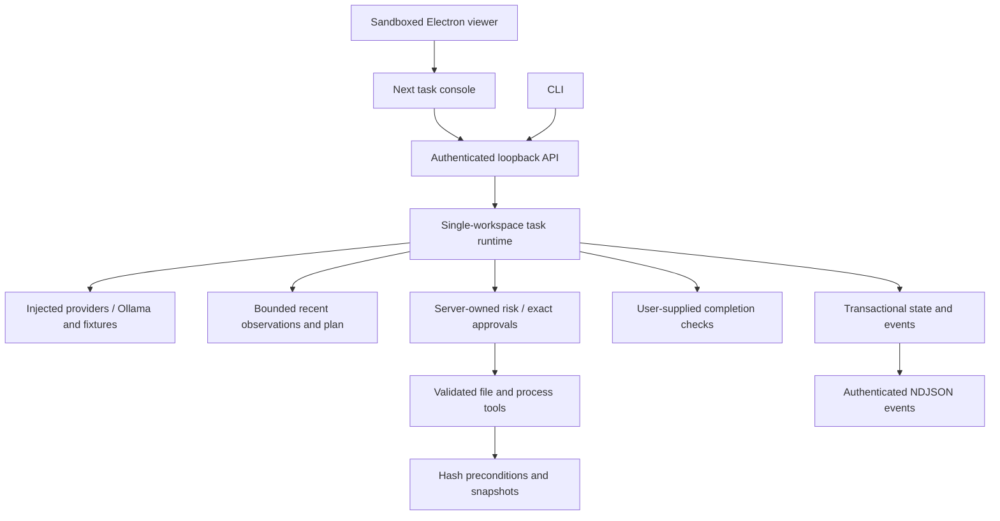

# Supported architecture

Source of truth: `packages/agent/src/runtime`. Workspace/provider configuration belongs to startup, not API callers. Providers return unknown output which the runtime validates. Each action updates a public plan, passes permission checks, executes one tool and adds an observation. The next decision sees outcomes, including errors. Finish initiates verification; it cannot directly mark completion.

One task runs per runtime/workspace, including canceled work still cleaning up. Each has an AbortController and deadline; approvals/pauses consume that deadline. Real Ollama calls also have request deadlines and bounded response bodies. Fallback uses only explicitly configured providers; unavailable models never silently become fixture success.

Context uses deterministic character budgets, not exact token estimates. Truncated history is labeled; full observations remain in local storage. Oversized criteria can be compressed in prompts but runtime verification uses originals. Memory is persisted task history, not cross-project learning or a vector database.

Queued tasks become running; running tasks may pause or await approval. Completed/failed/canceled/interrupted states never resume. Restart interrupts unfinished tasks after any stale data-directory lock is safely cleared (see security.md). The exclusive lock prevents a second runtime from reclassifying another live runtime's tasks. Checkpoint restore creates a separately approved operation whose success verifies restoration preconditions and the file operation, not the original objective.

UI polls once per second. NDJSON offers live state/tool events, heartbeats and slow-client disconnects, not model-token streaming. SQLite event IDs support per-task `after` replay. Latest 200 tasks load at startup. Long-term retention and multi-process coordination remain limitations.

The provider uses the [Ollama chat API](https://docs.ollama.com/api/chat): JSON response, bounded generation, usage counters when returned. Other providers can implement the interface; no untested commercial-provider support is claimed. Historical architecture is in `architecture-current.md` and `surface-audit.md`.
