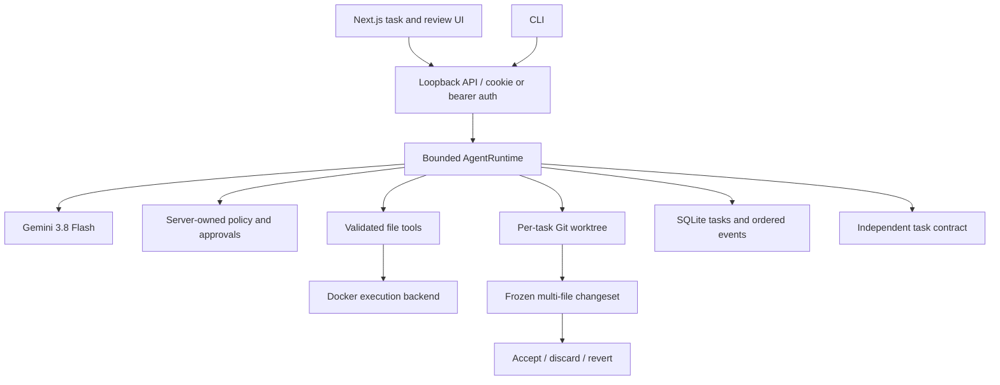

# Supported architecture

`packages/agent/src/runtime` is the source of truth. The model proposes one typed decision per turn. The runtime validates it, owns risk, executes the action, records the observation, and independently verifies a finish request. A model response cannot mark a task successful by itself.

Each isolated task gets a detached `--no-checkout` Git worktree populated from bounded regular source files, including safe dirty and untracked content. Preparation does not run repository checkout hooks, filters, textconv, or status/diff commands. The user's branch, index, and active files stay untouched while the task runs.

Commands go through an `ExecutionBackend`. Docker is the product default and receives only the task workspace, no Docker socket, no network, a read-only container root, dropped capabilities, one CPU, 512 MiB memory, 128 PIDs, bounded output, and a deadline. Native execution remains an explicit library backend for tests and exceptional local use.

After verification and process cleanup, the broker freezes exact before/after bytes and hashes into a canonical changeset. Acceptance preflights every destination before any write and journals progress. Conflicts preserve external edits. Revert uses the same all-file preflight. Discard removes only the owned task workspace and retains the audit manifest.

Gemini 3.8 Flash is the supported model. Per-call records contain provider, actual model, duration, input/output tokens, estimated cost, status, and sanitized error. There is no silent fallback to another model. FixtureProvider is an explicit deterministic test seam and is never reported as model capability.

SQLite commits each task snapshot and event together. Restart marks unfinished tasks interrupted instead of replaying uncertain effects. The UI presents the objective, plan, current action, approval, result, and changeset; raw events and digests stay in advanced views. The launcher exchanges a five-minute one-use URL-fragment capability for an HttpOnly SameSite browser session.

The 50-task coding benchmark is separate from the 42-case runtime safety evaluation. Benchmark graders stay outside the model workspace and candidate code runs in a no-network Docker container with read-only mounts. Known-bad fixtures must fail and reference solutions must pass before a case counts as valid.
